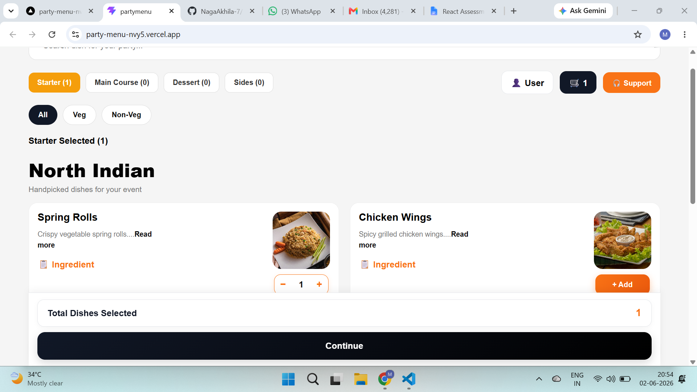
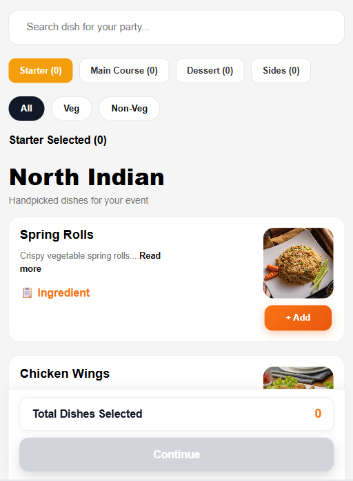
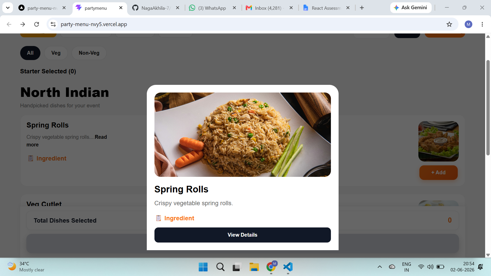
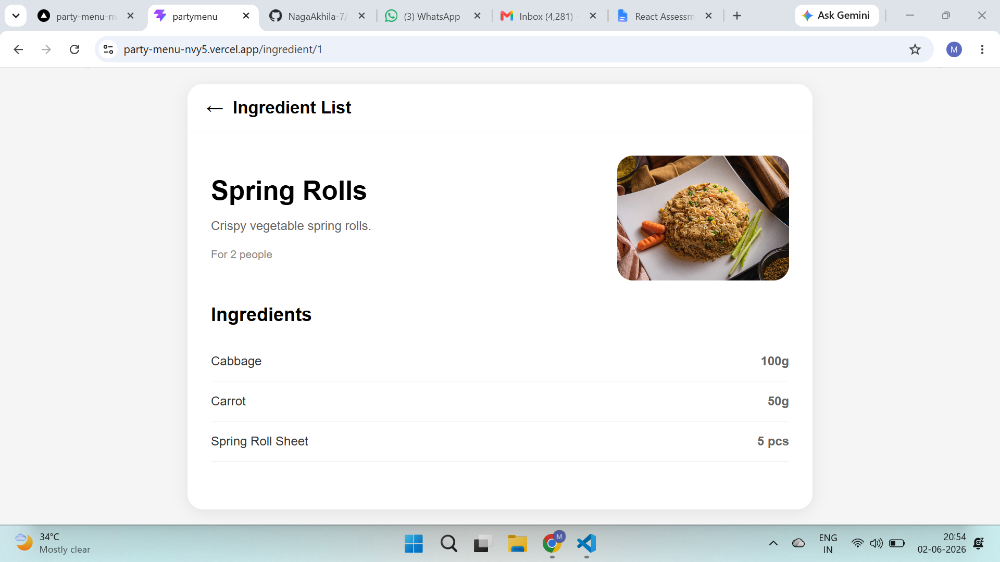

# Party Menu Selection App

A responsive ReactJS application that allows users to browse dishes, filter menu items, search dishes, select items for a party, and view ingredient details.

This project was developed as part of a Frontend React Assignment to demonstrate React fundamentals, state management, filtering logic, routing, responsive UI design, and component-based architecture.

---

## 🚀 Features

### 📌 Menu Categories

Users can browse dishes by category:

- Starter
- Main Course
- Dessert
- Sides

The selected category is highlighted and displays only relevant dishes.

---

### 🔍 Search Functionality

- Search dishes by name
- Case-insensitive search
- Works within the selected category

---

### 🥗 Veg / Non-Veg Filter

Users can filter dishes using:

- All
- Veg
- Non-Veg

Filters work together with category selection and search.

---

### 🛒 Dish Selection

Users can:

- Add dishes
- Increase quantity
- Decrease quantity
- Remove dishes
- View total selected dishes

---

### 📋 Ingredient Details

Each dish includes an Ingredient option.

Users can view:

- Dish name
- Dish description
- Ingredient list
- Ingredient quantities

---

### 📱 Responsive Design

The application is fully responsive and optimized for:

- Mobile Devices
- Tablets
- Laptops
- Desktop Screens

---

### ✨ UI Enhancements

Additional improvements implemented:

- Modern responsive layout
- Premium quantity selector (- / +)
- Bottom sheet dish details
- Category-wise selected count
- Dish selection summary footer
- Professional menu card design
- Desktop and Mobile optimized layouts

---

## 🛠️ Technologies Used

- ReactJS
- React Router DOM
- JavaScript (ES6+)
- HTML5
- CSS3
- Vite

---

## 📂 Project Structure

```text
src
│
├── data
│   └── menuData.js
│
├── pages
│   ├── MenuPage.jsx
│   └── IngredientPage.jsx
│
├── App.jsx
├── main.jsx
└── index.css
```

---

## 📸 Screenshots

### 🖥️ Desktop View



### 📱 Mobile View



### 🍽️ Explore Dish Modal



### 📋 Ingredient Detail Screen



---

## 📊 Assignment Requirements Covered

### ✅ Menu Categories

- Starter
- Main Course
- Dessert
- Sides

### ✅ Dish Listing

Each dish displays:

- Name
- Description
- Image
- Add / Remove functionality
- Ingredient option

### ✅ Search Functionality

- Case-insensitive search
- Category-specific search

### ✅ Veg / Non-Veg Filtering

- Veg filter
- Non-Veg filter
- Combined filtering support

### ✅ Dish Selection Summary

- Category-wise selected count
- Total selected dishes count
- Continue button

### ✅ Ingredient Detail Screen

Displays:

- Dish Name
- Description
- Ingredient List
- Ingredient Quantities

### ✅ Mock JSON Data

All menu and ingredient information is rendered from a local JSON file.

### ✅ React Hooks

Implemented using:

- useState
- useNavigate
- useParams

### ✅ Navigation

Implemented using React Router DOM.

### ✅ Responsive UI

Works across multiple screen sizes.

---

## ▶️ Getting Started

### Clone Repository

```bash
git clone https://github.com/NagaAkhila-7/PartyMenu
```

### Navigate to Project Folder

```bash
cd party-menu-app
```

### Install Dependencies

```bash
npm install
```

### Run Development Server

```bash
npm run dev
```

### Build Project

```bash
npm run build
```

### Preview Production Build

```bash
npm run preview
```

---

## 🔮 Future Improvements

Potential enhancements:

- Dark Mode / Light Mode
- Cart Summary Page
- Local Storage Support
- Price Calculation
- User Authentication
- Backend Integration
- Online Ordering Flow

---

## 👨‍💻 Author

**Malineni Naga Akhila**

Frontend Developer | React Enthusiast

GitHub: https://github.com/your-github-username
